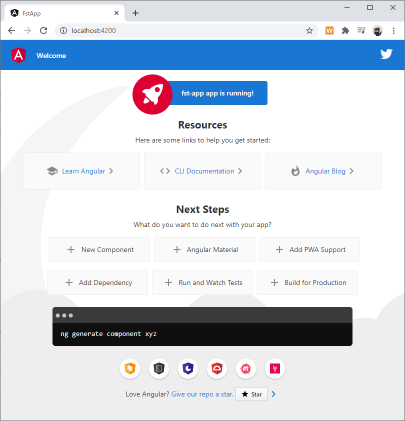

## Angular

### 使い始め

- 前準備
    - プロジェクトフォルダを作成し、プロジェクトを初期化
    ```cmd
    > mkdir projectFolder
    > cd projectFolder
    > npm init
    ```

### Angular 開発環境の設定

- Angular cli インストール
    - Angular の操作、環境構築などをコマンドラインで実行するためのツール
    - なんとなく環境汚したくないので `-g` オプションはつけない
    - あくまでツールであり、本番環境では不要なので`-D`オプションをつける
    ```cmd
    > npm i -D @angular/cli
    ```

### Angular アプリの作成

- アプリケーションが属するプロジェクトの作成
    - routing は `y`
    - Stylesheet は `CSS` か `Sass`
    ```cmd
    npx ng new fst-app
    ```

- サーバーを起動する
    -　アプリケーションフォルダに移動してサーバを起動
    - `Compiled successfully` が表示されたら、`http://localhost:4200` へアクセス
    ```cmd
    > cd fst-app
    > npx ng serve --open または npx ng s -o
    ```

    

### コンポーネントの追加

- `header` コンポーネントの追加
    - `fst-app/src/app/` 配下に `header` コンポーネントファイル `header.component.html`、`header.component.spec.ts`、`header.component.ts`、`header.component.css` が生成され、`/app/` フォルダ直下の `app.modules.ts` が更新され、`import { HeaderComponent } from './header/header.component';` 行が追加される
    ```cmd
    > npx ng generate component header
    ```

#### コンポーネントツリー
    


### 変数の利用

- 変数の設定
    - 追加したコンポーネント（`header/header.component.ts`) ファイルに変数を設定。
    ```ts
    :
    export class HeaderComponent implements OnInit {
        title: string; <-- ★

        constructor() { 
            this.title = 'Angular Sample Console!'; <-- ★
        }
    :
    ```
- 変数の表示
    - 追加したコンポーネント（`header/header.component.html`) ファイルに変数 `{{ title }}` を設定。
    ```html
    <div class="header">
         {{ title }}
    </div>
    ```
